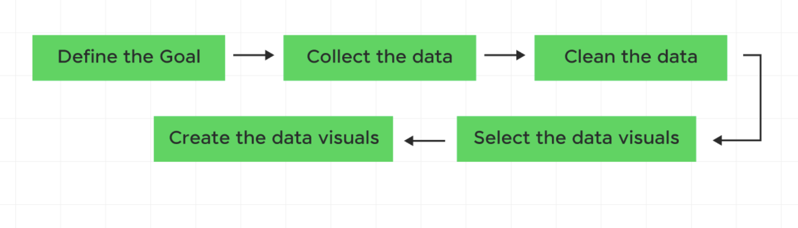
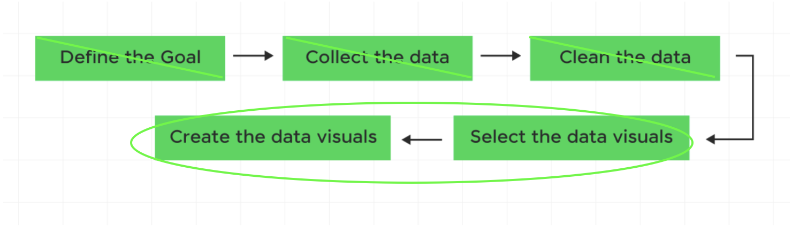
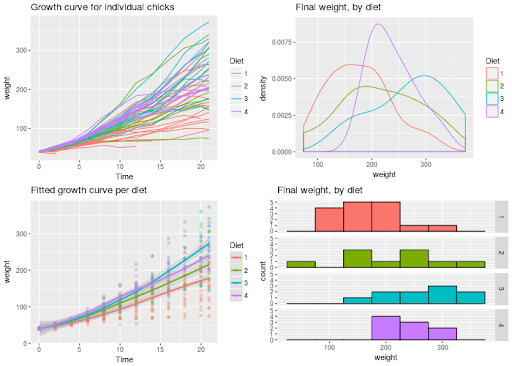

## Agenda

- Reading discussion  
- EDA: preparing data for graphics
- `ggplot2`: why do we use it?
- Activity: coding practice


## {background-image="images/frame_generic_light.png" background-size="contain" background-position="center"}


## {background-image="images/frame_generic_light2.png" background-size="contain" background-position="center"}


# Reading Discussion {.smaller}

In groups of 2-3, discuss the reading:

1. Review: What data is used in this graphic? What is a cause of potential messiness that would need to be addressed?
2. What's one thing you liked about how the graphic portrays the data?
3. What's one thing you would change about the graphic to make it better?

``

# Reminder of DataViz Workflow



## Reminder of DataViz Workflow


# Exploratory Data Analysis

After having cleaned the data, we want to get a sense of what we are looking at.\
\
Let's use our `farm_data` data as an example.

```{r}
# Recall our farm data:
library(tidyverse)
farm_data <- tibble(
  employee_id = 1:10,
  hours_worked = c(40, 55, 38, 60, 45, 50, 42, 65, 37, 48),
  seasonal_worker = c(TRUE, TRUE, FALSE, TRUE, FALSE, TRUE, FALSE, TRUE, FALSE, FALSE),
  supervisor = c(FALSE, FALSE, TRUE, FALSE, TRUE, FALSE, TRUE, FALSE, TRUE, FALSE),
  commute_min = c(15, 35, 20, 50, 10, 40, 25, 60, 12, 30),
  primary_crop = c("Corn", "Wheat", "Corn", "Soy",
                   "Soy", "Wheat", "Corn", "Soy",
                   "Corn", "Wheat"),
  years_experience = c(2, 5, 10, 3, 12, 4, 8, 1, 15, 6),
  hourly_wage = c(18, 20, 25, 19, 28, 21, 24, 17, 30, 23)
)

farm_data
```

## Q1: What are the cols and rows?

. . .

```{r}
dim(farm_data)
```

. . .

```{r}
sapply(farm_data, class)
```

## Q1: What are the cols and rows?

```{r}
farm_data
```

## Q1: What are the cols and rows?

-   Unit of observation: an individual farm worker
-   Variables: employee ID (integer), hours worked (numeric), seasonal worker (logical), supervisor (logical), commute in minutes (numeric), primary crop (character), years of experience (numeric), hourly wage (numeric)

. . .

> A description of the variables is often stored in a separate file called a *data dictionary*.

## Q2: Is there any missing data?

. . .

**Option 1**: Total missing values

```{r}
library(dplyr)
sum(is.na(farm_data))
```

. . .

**Option 2**: Proportion missing counts

```{r}
farm_data |>
  summarize(across(everything(), ~ mean(is.na(.))))
```

## Q3: What is the distribution of `years_experience`? {auto-animate="true"}

. . .

```{r}
library(ggplot2)
farm_data |>
  ggplot(aes(x = years_experience)) +
  geom_bar()
```

## Q3: What is the distribution of `years_experience`? {auto-animate="true"}

```{r}
farm_data |>
  ggplot(aes(y = years_experience)) +
  geom_bar()
```

## `geom_bar()` {auto-animate="true"}

. . .

`geom_bar()` counts up the number of observations in each level of a single variable, then draws bars up to that height.

## Summarizing with counts {auto-animate="true"}

. . .

```{r}
farm_data |>
  group_by(primary_crop) |>
  summarize(count = n())
```

## `geom_col()`

. . .

`geom_col()` takes one column of categories and draws a bar for each up to the height of a second column of counts.

. . .

```{r}
farm_data |>
  count(primary_crop) |>
  ggplot(aes(y = primary_crop, x = n)) +
  geom_col()
```

## Two types of Viz

::::: columns
::: column
### Exploratory Data Analysis (EDA)
:::

::: column
### Explanatory Data Analysis
:::
:::::

::: notes
Add notes to each:

Exploratory: - consumer: the analyst - goal: uncover structure for further analysis - follow templates - prioritize quick and accurate interpretation

Explanatory: - consumer: stakeholder - goal: tell a specific story - customized - polished aesthetic
:::

## Reminder of DataViz Workflow



# What is ggplot2?

- Last week: packages in R \
- Today: `ggplot2` package \
- A data visualization package for the R programming language \

## Examples of graphs we can make with `ggplot2`




## `ggplot2()`

. . .

A plot can be decomposed into three primary elements (according to grammar of graphics):

1. the **data**,
2. the **aesthetic mapping** of the variables in the data to visual channels, and
3. the **geometry** used to translate the observations into marks on the plot.


## {.smaller auto-animate=true}

::: {.columns}
::: {.column}
```{r}
library(tidyverse)
library(dplyr)
library(palmerpenguins)
#| label: "hi mom"
penguins |>
  select(bill_length_mm,
         flipper_length_mm,
         species)
```
:::
::: {.column .fragment}
```{r}
#| echo: false
#| fig-height: 9
penguins |>
  ggplot(aes(x = bill_length_mm,
             y = flipper_length_mm,
             color = species)) +
  geom_point() +
  theme_gray(base_size = 18)
```
:::
:::

::: notes
Draw arrows mapping variables to visual cues
:::

## {.smaller auto-animate=true}

::: {.columns}
::: {.column}
```{r}
#| eval: false
penguins |>
  ggplot(aes(x = bill_length_mm,
             y = flipper_length_mm,
             color = species)) +
  geom_point()
```
:::
::: {.column}
```{r}
#| echo: false
#| fig-height: 9
penguins |>
  ggplot(aes(x = bill_length_mm,
             y = flipper_length_mm,
             color = species)) +
  geom_point() +
  theme_gray(base_size = 18)
```
:::
:::


## `ggplot2()` syntax

. . .

`ggplot2()` builds a plot layer by layer, each one added on top of one another with `+` (not `|>`).

. . .

- `ggplot(df)` creates canvas
- `aes()` creates mappings, called inside `ggplot()` or a `geom()`
- `geom_()` puts down marks using declared geometry

## Layer by layer

```{r}
#| eval: false
penguins |>
  ggplot(aes(x = bill_length_mm,
             y = flipper_length_mm,
             color = species)) +
  geom_point() +
  theme_gray(base_size = 18)
```


## Common `aes()`

::: {.columns}
::: {.column}
- `x`
- `y`
- `color`
- `fill`
:::
::: {.column}
- `size`
- `shape`
- `alpha`
:::
:::

## Common `geom_()`

::: {.columns}
::: {.column}
- `geom_point()`
- `geom_bar() / geom_col()`
- `geom_line()`
:::
::: {.column}
- `geom_histogram()`
- `geom_boxplot()`
- `geom_violin()`
- `geom_density()`
:::
:::


# Activity: Coding Practice
Go to BCourses and download the `week4-activity.qmd` file to work on today's coding activity.

# Next level

Let's practice making some graphs with `ggplot2`!

1. Open RStudio and create a new Quarto document.
2. Load the `palmerpenguins` package and the `penguins` dataset.
3. Create a scatter plot of `bill_length_mm` vs `flipper_length_mm`, colored by `species`.
4. Experiment with different `geom_()` functions to visualize the data
5. Customize your plots with themes and labels.

