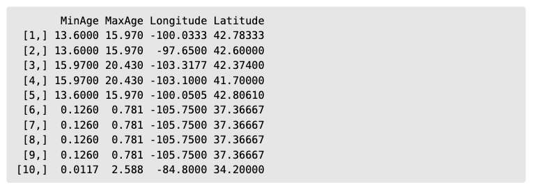
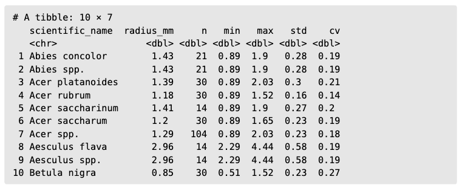
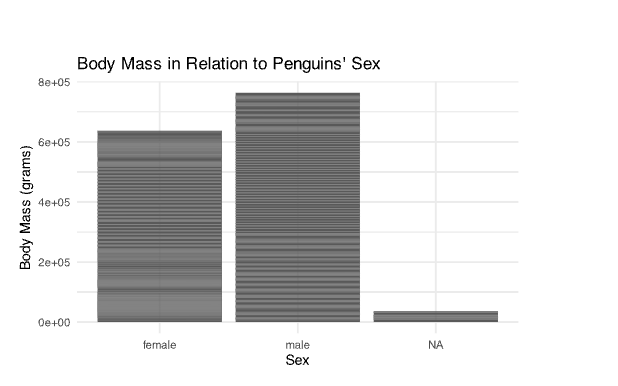

# Data Types & Chart Selection

## Types of Variables

 Assign the right number to each sentence:

@. ) Binary 
@. ) Ordinal 
@. ) Nominal 
@. ) Continuous 
@. ) Discrete

___ Can take any countable value represented as an integer

___ Categories have no clear order, and are mutually exclusive

___ Only takes two possible values, and are typically represented as 1 or 0.

___ Have a clear ordering of the categories

___ Can take any measurable value within a given range, including fractions and decimals 


## Analytical Goals and Chart Selection

For the following datasets (6-8), **1)** come up with an analytical  goal, **2)** state what variables you will use and identify its type, and **3)** identify what chart will facilitate your observations.

@. A dataset of laboratory measurements of kidney function over time for the 1500 patients with the following variables:

-   **ID**: patient identifiers
-   **TRTPN**: treatment values, 1 Active or 2 Placebo
-   **AVAL**: measurement value
-   **ADAY**: measurement day in the study
-   **AVISITN**: hospital visit number
-   **PARAM**: name of the event, GFR measurement
-   **PARAMCD**: coded name of the event, GFR
-   **PARAMN**: type of the event is set to 7 for all measurements

\ 
\ 
\ 


#### Your Answer:

{fig-align="center" width=600px}


@. A data frame where each row is a single fossil with the following variables:

-   **MinAge**: Minimum age of fossil
-   **MaxAge**: Maximum age of fossil
-   **Longitude**: Longitude of occurrence
-   **Latitude**: Latitude of occurrence




#### Your Answer:

{fig-align="center" width=600px}


@. Database of twig radii by tree species data with the following variables:

-   **scientific_name**: The tree's genus and species
-   **radius_mm**: The average twig radius in millimeters
-   **n**: The twig measurement sample size
-   **min**: The minimum twig radii from the samples
-   **max**: The maximum twig radii from the samples
-   **std**: The standard deviation of twig radii
-   **cv**: The coefficient of variation of twig radii




#### Your Answer:

{fig-align="center" width=600px}

# Grammar of Graphics

## Understandig GG

@. GG allows creation of graphs to be _________, __________, and ________ 

@. What is aesthetic mapping?


#### Your Answer:

{fig-align="center" width=600px}


@. Who formalized the grammar of graphics?

a) Clara Reckhorn
b) Leland Wilkinson
c) Stephen Few
d) Kieran Healy

@. Which of these **isn't** part of the GG elements

a) Statistics
b) Theme
c) Analysis 
d) Coordinates

## Application

```{r}
#| echo: false
#| output: false
#| eval: false
library(tidyverse)
suppressWarnings(library(palmerpenguins))
palmers = palmerpenguins::penguins

plot1 = palmers |>
  ggplot(aes(x = sex, y = body_mass_g)) +
  geom_col() +
  labs(title = "Body Mass in Relation to Penguins' Sex",
       x = "Sex",
       y = "Body Mass (grams)") +
  theme_minimal()

suppressWarnings(plot1)
  
```



@. Identify the following GG elements for the plot above:
dataset, aesthetic mapping, and geometry

# Data Cleaning

## Open ended

@. Why is data cleaning important?


#### Your Answer:

{fig-align="center" width=600px}

\ 
\ 
\ 

\ 
\ 
\ 
\ 

## Multiple Choice
\
 \ 
 \ 
 \ 

A dataset contains the following column:

|Transfer Students|
|-----------------|
| Transfer|
| transfer|
| T |
| non transfer|
| NT |
| Non-transfer |

@. What is the main data cleaning issue here?

a) Missing values
b) Duplicate rows
c) Inconsistent categorical labels
d) Incorrect numerical values

@. Why is data cleaning necessary before running statistical analysis?

a) Because statistical models understand the meaning of messy data
b) Because computers automatically interpret inconsistent labels correctly
c) Because computers require structured, consistent inputs to produce valid results


@. If a company does not properly clean its sales data before building a predictive model, what is the most likely outcome?

a) The model will run faster
b) The model will automatically fix errors
c) The results may be biased or misleading
d) The model will become more accurate

# EDA

@. Which of the following is the MOST accurate description of what EDA helps a data analyst accomplish? (only one option)

a) It proves that a hypothesis is correct.
b) It replaces the need for statistical tests.
c) It helps identify patterns, anomalies, and variable relationships before formal analysis.
d) It converts categorical variables to continuous ones.

@. True or False: EDA is only necessary when a researcher suspects there are errors in the dataset.

# ggplot2

@. In ggplot2, what is the purpose of aes()?

#### Your Answer:

{fig-align="center" width=600px}


@. Which function do you use to initialize a plot in ggplot2?

a) plot()
b) ggplot()
c) graph()
d) draw()

Fill in the blanks with either + or |> in the correct places:
```{r}
#| echo: true
#| eval: false
data _____ 
  filter(year == 2020) _____ 
  ggplot(aes(x = age, y = income)) _____ 
  geom_point() _____ 
  theme_minimal()
```
