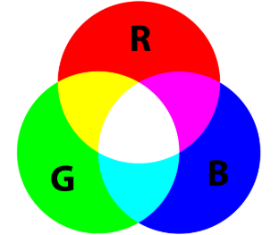
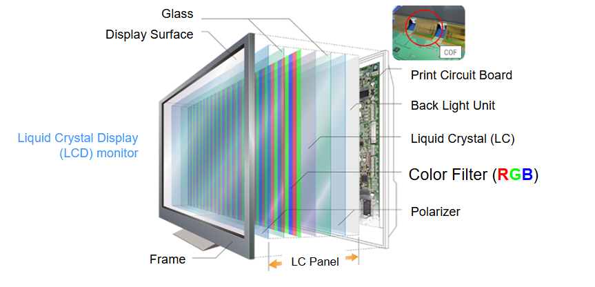
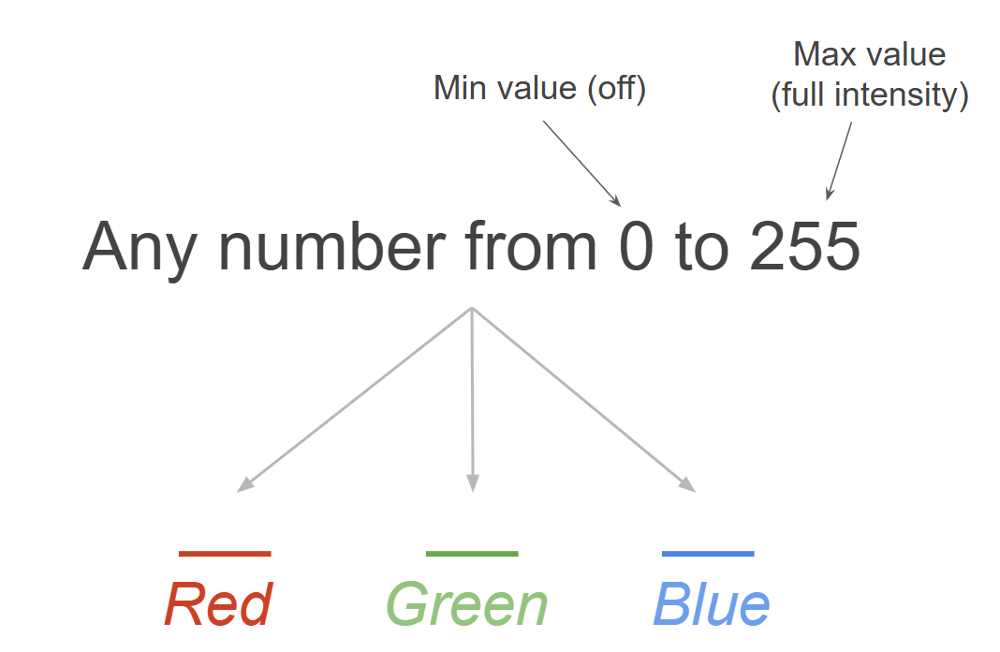
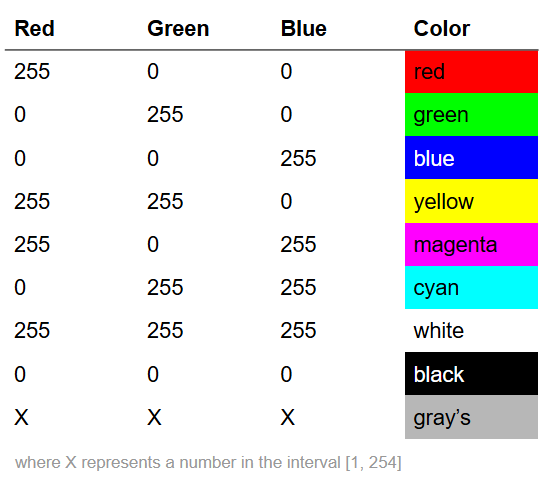

# Agenda

-   Quiz covering week 2 to week 4
-   RGB Model: effective use of color in graphs
-   Activity

# Quiz

You will have 35 minutes to complete the quiz. Good luck (and may the odds be ever in your favor)!!

```{r}
#| echo: false
countdown::countdown(35, top=0)
```


# RGB Model

. . .

The **R**ed **G**reen **B**lue **Model** is based on the trichromatic theory.

{fig-align="center"}

::: {.notes}
The trichromatic theory explains human color vision as the result of three types of cone cells in the retina, each sensitive to red, green, or blue light whose combined activity allows us to perceive the full spectrum of colors.
:::
## RGB

Red, Green, and Blue light sources are combined to display colors on televisions and computer monitors.

{fig-align="center"}

## RGB

Therefore, any color you see on a monitor can be described by a series of 3 values (in the following order):

-   [Red]{style="color:red;"} value
-   [Blue]{style="color:blue;"} value
-   [Green]{style="color:green;"} value

# RGB Decimal Notation
. . .

{fig-alig="center"}


## RGB Reference Colors
. . .

{fig-alig="center"}

**Example notations:** 
-   <span style="color:yellow;">Yellow</span>: (255,255,0)
-   

# Why do RGB


