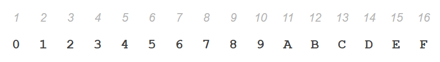
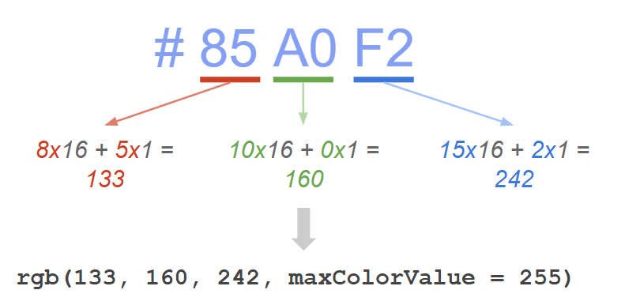

# Agenda

-   Quiz covering week 2 to week 4
-   RGB Model: building a foundation of color
-   Coding activity: 

# Quiz

You will have 35 minutes to complete the quiz. Good luck (and may the odds be ever in your favor)!!

```{r}
#| echo: false
countdown::countdown(35, top=0)
```

# Introduction to Color
. . . 

The use of color is a big aspect in any visual display for two main reasons:

-   We need to make decisions about what colors to use and for what purpose
-   We must tell a computer those colors.

## Common purposes for color usage

-   **Data encoding** 

-   **Design aspects**

::: {.notes}
Data encoding: A main use of color (although not the only one) is to encode data. This encoding chiefly depends on the type of variables we are working with (e.g. qualitative or quantitative, discrete or continuous).
Design aspects: Another important use of color has to do with design considerations such as psychology of color, decorative purposes, harmony, and things like that.
:::

## How do we specify color in a computational sense?

::: {.notes}
How do we tell a computer program what kind of color we want to use? The answer to this question is given by Color Models, and their associated color spaces (or geometric volumes).
:::
# RGB Model

. . .

The **R**ed **G**reen **B**lue **Model** is based on the trichromatic theory.

{fig-align="center"}

::: {.notes}
The trichromatic theory explains human color vision as the result of three types of cone cells in the retina, each sensitive to red, green, or blue light whose combined activity allows us to perceive the full spectrum of colors.
:::
## RGB

Red, Green, and Blue light sources are combined to display colors on televisions and computer monitors.

{fig-align="center"}

## RGB

Therefore, any color you see on a monitor can be described by a series of 3 values (in the following order):

-   [Red]{style="color:red;"} value
-   [Blue]{style="color:blue;"} value
-   [Green]{style="color:green;"} value

# RGB Decimal Notation
. . .

{fig-align="center"}


## RGB Reference Colors
. . .

{fig-align="center"}

## Model and its (cubic) geometric space

{fig-alig="center"}

You can play around with this cube [here](https://www.infinityinsight.com/product.php?id=91)!

# Why do RGB values range from 0 to 255?

There are 256 numbers from 0 to 255

256 = 2<sup>8</sup>

{fig-align="center"}

## Hexadecimal Notation

Hexadecimal representation uses 16 different symbols:

-   First 10 digits (0-9)

-   First 6 letters (A-F) which represent  values 10 to 15

This allows computers to store more information in less  digits

::: {.notes}
In a picture, a computer takes each pixel and stores its RGB number, so it would need many numbers if it were to use decimal notation.
:::

{fig-align="center"}

## Hexadecimal Color: #85A0F2

-   **#** is the universal notation for a "hex number"
-   Each pair of symbols represents one pair of primary color


## From HEX to RGB (in R)

{fig-align="center"}


# Coding Activity

1. Go into your console and type: install.packages("colourpicker")

2. In a code chunk, try to come up with interesting colors using the `rgb()` function.

3. In a different code chunk, access the colorpicker widget as follows: `colourpicker::colourWidget()`


# Reading for next week

[Age of US Presidents](https://www.pewresearch.org/short-reads/2023/10/10/most-us-presidents-have-been-in-their-50s-at-inauguration/)


