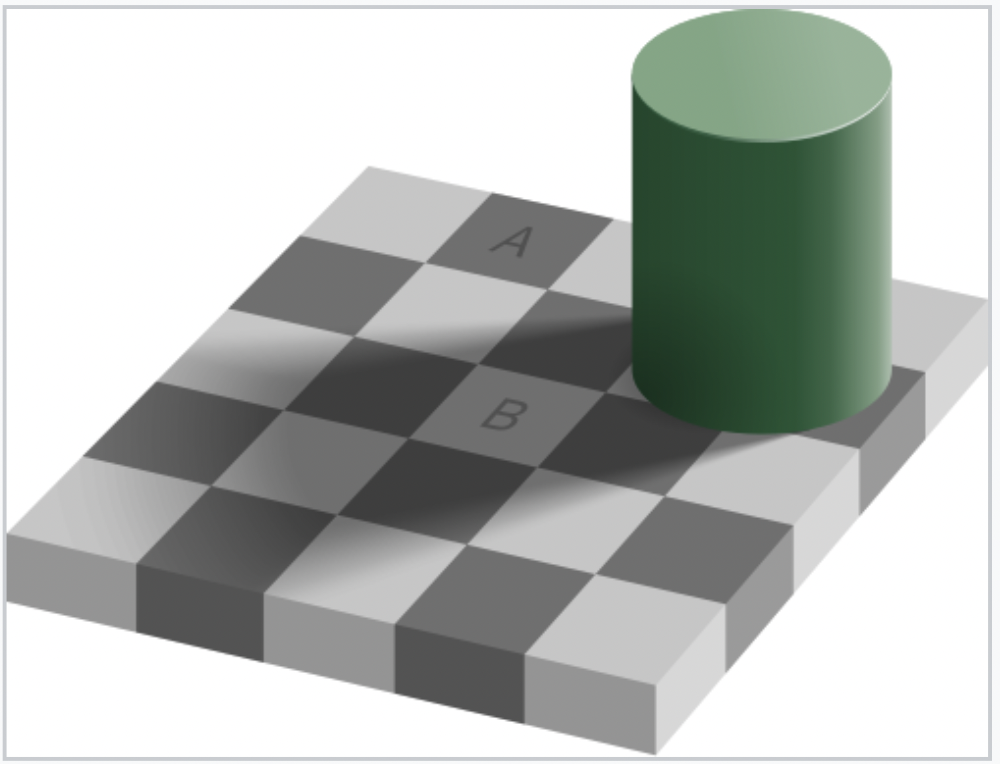

## Agenda

1.  Discussion of Reading

2.  Why Color Matters

3.  Demo - Adelson checker shadow illusion

4.  Lecture on Color Packages

5.  Activity no.1 + discussion + Activity no.2


## Discussion of Reading

**Reading:** [What Data Shows About Vaccine Supply and Demand in the Most Vulnerable Places](https://www.nytimes.com/interactive/2021/12/09/world/vaccine-inequity-supply.html)

1.  What role does the subtitle of the visuals play? What would you add/remove?\
2.  How do the labels, captions, or notes help you interpret the graph?\
3.  In what ways do the graphs differ? Consider the context, data, subtitles, description, etc.\

## Why Color Matters in Data Visualization

Color is one of the most powerful visual tools in a graphic.\

It helps us distinguish groups, highlight patterns, and encode information.\
But before deciding how to use color, we need to understand what type of data we are visualizing.\
In visualization, data typically falls into two main categories: 

## Main categories
1. Categorical (Qualitative) – represents groups or labels\
- Binary (two categories)\
- Nominal (categories with no order)\
- Ordinal (categories with a meaningful order)\
2. Quantitative (Numerical) – represents measurable values\
- Discrete (countable values)\
- Continuous (values on a continuous scale)\

## Is A and B the same color?

{fig-alig="center"}


## Why Color Perception Matters
[Demo](https://en.wikipedia.org/wiki/Checker_shadow_illusion)\
This famous illusion demonstrates that our perception of color is influenced by surrounding context.
Even when two squares are the exact same color, our brain interprets them differently because of lighting and shadow.
\


If color is not chosen carefully, viewers may misinterpret differences in the data.

## Why Color Choice Matters
Human color perception is relative and context-dependent.\
The Adelson Checker Shadow Illusion shows that the same color can appear different depending on its surroundings.\
In visualizations, non-uniform color scales (like rainbow) can distort patterns:\

- Some transitions appear more dramatic than others\

- Middle values may seem more important due to bright colors\

Choosing the right color scale is critical for accurate data interpretation.


## Let's Look at ColorBrewer
We will use ColorBrewer as a tool to explore different color palettes designed specifically for visualizing different types of data.\
[ColorBrewer Website](https://colorbrewer2.org/#type=sequential&scheme=BuGn&n=3)
ColorBrewer organizes color palettes into three main types:\

-   **Qualitative**: categorical variables (unordered)

-   **Sequential**: ordered categorical, numeric variables (single direction)

-   **Diverging**: numeric variables (numeric variables with meaningful midpoint) \ 


## Some R Packages for Color Palettes

[Let's look at the datanovia website!](https://www.datanovia.com/en/blog/top-r-color-palettes-to-know-for-great-data-visualization/)

-   Viridis color scales \[viridis package\]

-   Colorbrewer palettes \[RColorBrewer package\]

-   Grey color palettes \[ggplot2 package\]

-   Scientific journal color palettes \[ggsci package\]

-   Wes Anderson color palettes \[wesanderson package\]

-   R base color palettes: rainbow, heat.colors, cm.colors.

*Warning: not all palettes are perceptually uniform!*

## Perceptually Uniform Color Scales
Perceptually uniform scales ensure that equal changes in data correspond to equal visual differences in color.\
Benefits:\
- Accurate data interpretation: patterns are represented faithfully\
- Avoids visual misrepresentation: no unintended emphasis on certain ranges\
- Inclusivity & accessibility: many scales are colorblind-friendly, greyscale-printable, and intuitive\

If a color scale isn’t uniform, it might make some values look more important than they actually are, or hide patterns that are there. So you end up telling a misleading story with your graph—even if the data is correct.

## In ggplot2, color palettes are applied using `scale_color_*()` functions.
These functions control how values in a variable are mapped to colors in a plot.\

Important points:
-  `scale_color_*()` is where palettes are applied\
-  Different palettes come from different R packages\
-  Changing the palette does not change the data or the plot structure\
-  It only changes the visual style of the graphic\

## Example using packages 
```{r}
#| eval: false
#Simple example, don't forget to install packages :)
ggplot(data, aes(x, y, color = group)) +
  geom_point() +
  scale_color_viridis_d()
```


## How ggplot assignes color 
When you map a variable to the **color aesthetic**, ggplot automatically chooses colors depending on the **data type** of that variable:

| Data Type            | Default Color Behavior |
|----------------------|------------------------|
| Logical (TRUE/FALSE) | Two colors (discrete)  |
| Integer / Double     | Gradient (continuous)  |
| Factor               | Discrete palette       |
| Character            | Discrete palette       |

## Demo Dataset

Let’s create a small data frame with several variable types.

```{r}
#| echo: true
#| output-location: column-fragment
library(ggplot2)
set.seed(123)

demo_df <- data.frame(
  x = rnorm(20),
  y = rnorm(20),
  logical_var = sample(c(TRUE, FALSE), 20, replace = TRUE),
  integer_var = sample(1:5, 20, replace = TRUE),
  double_var = runif(20, 0, 10),
  factor_var = factor(sample(letters[1:3], 20, replace = TRUE)),
  char_var = sample(c("cat", "dog", "bird"), 20, replace = TRUE)
)

head(demo_df)

```

## Mapping color to each variable:

```{r}
# Logical (two-color discrete)
ggplot(demo_df, aes(x, y, color = logical_var)) +
  geom_point(size = 4) +
  labs(title = "Logical Variable")
```

## Mapping color to each variable:
```{r}
# Integer (continuous gradient)
ggplot(demo_df, aes(x, y, color = integer_var)) +
  geom_point(size = 4) +
  labs(title = "Integer Variable")
```

## Mapping color to each variable:
```{r}
# Factor (discrete palette)
ggplot(demo_df, aes(x, y, color = factor_var)) +
  geom_point(size = 4) +
  labs(title = "Factor Variable") 

```


## Activity: Customize the Color Scales

Recreate the plots, but use a color scale function to control the palette.

Experiment with both discrete and continuous color scales.

```{r}
# Discrete manual colors for factor or character variables
ggplot(demo_df, aes(x, y, color = char_var)) +
  geom_point(size = 4) +
  scale_color_manual(values = c("cat" = "orange", "dog" = "steelblue", "bird" = "forestgreen")) +
  labs(title = "Custom Discrete Colors")

# Continuous gradient for numeric variable
ggplot(demo_df, aes(x, y, color = double_var)) +
  geom_point(size = 4) +
  scale_color_continuous(low = "lightblue", high = "darkblue") +
  labs(title = "Custom Continuous Scale")

# Using scale_fill_discrete() with filled geoms
ggplot(demo_df, aes(x = factor_var, fill = char_var)) +
  geom_bar() +
  scale_fill_discrete() +
  labs(title = "Bar Plot with Discrete Fill")

```

## Discussion

What happens when you map a numeric variable to **color** vs. a **factor variable**?\

How can you **control or standardize** color use across plots?\

When should you **manually define colors** rather than relying on defaults?\


## HW6 - Recreating

-   **Article**: Data About Covid Vaccine Supply and Demand (NYT)

-   <https://www.nytimes.com/interactive/2021/12/09/world/vaccine-inequity-supply.html>

    -   The graphic of interest is the animated scatterplot

    -   This article involves the use of a complementary-and-adjacent color scheme, orange-teal

    -   We have the data to replicate this animation in the next lecture; this would require introducing a couple of functions from the package “gganimate”

    -   CSV data file: vaccination-gdp-countries-2021.csv
