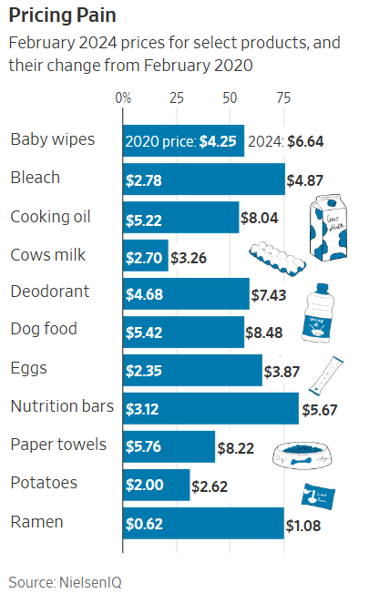
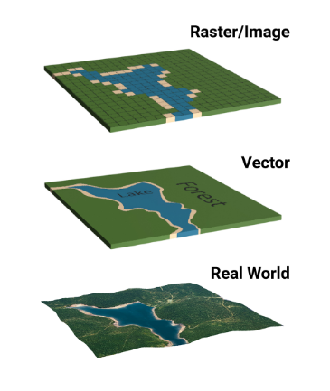
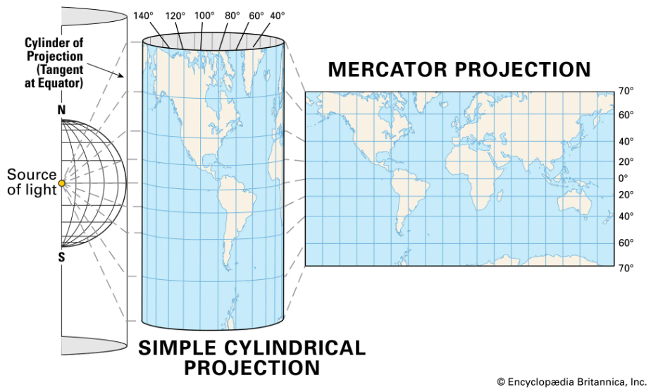
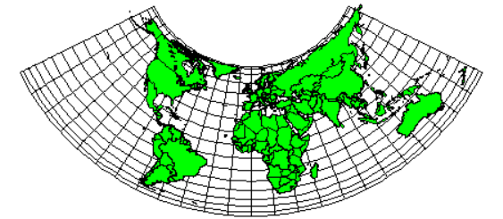
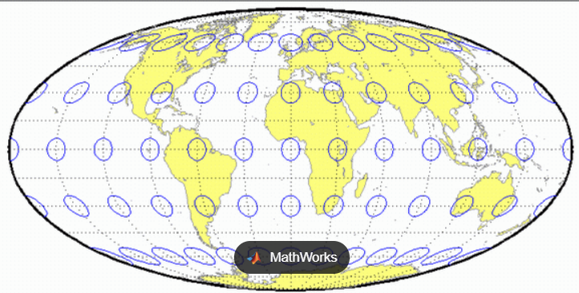
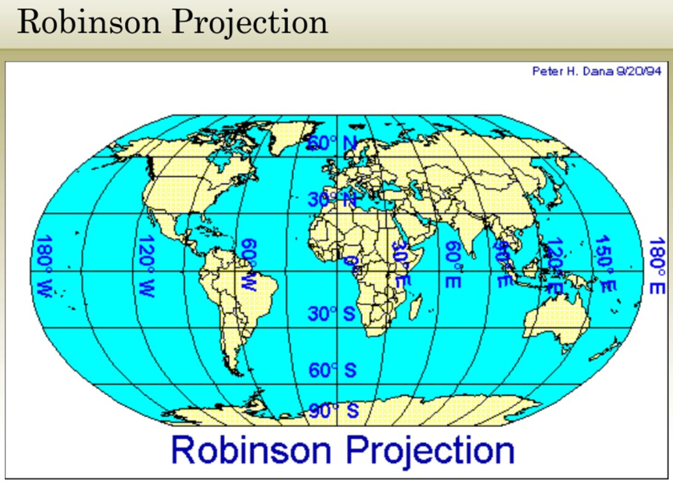
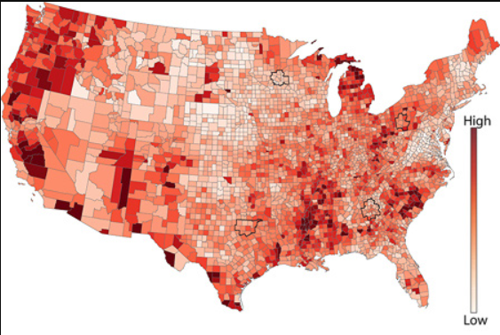
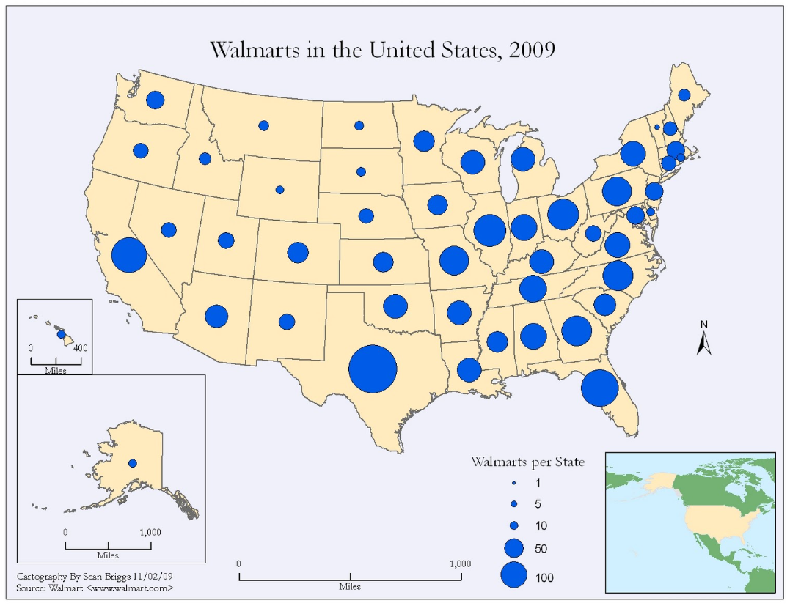

# Agenda

1.  Discussion of reading

2.  Geographic Data

3.  Projections and Coordinates

4.  Map Visualizations

5.  Activity: Choropleth Map Recreation

# Icebreaker

::: incremental
-   Open your Weather app
-   Give your neighbor context for each of your locations
:::

# Reading Discussion

Article: [We Still Don't Believe How Much Things Cost](https://www.wsj.com/economy/consumers/grocery-prices-inflation-coffee-milk-903aead6)

## Discuss in groups of 2-3

::::: columns
::: {.column width="60%"}
1.  **Review:** What data is shown? How many of Gestalt Principles can you identify?

2.  **Praise:** How does this graphic help you analyze the data the most?

3.  **Critique:** What's one thing that could potentially create confusion or be misleading? How would you fix that?
:::

::: {.column width="40%"}

:::
:::::

# Learning Goals

::: incremental
1.  **Explain** why spatial data matters
2.  **Apply** spatial data to Choropleth Maps
:::

# What is Spatial Data?

## Geospatial data

Refers to information that identifies the **location, shape**, and **relationships** of objects on Earth using [coordinates, maps, or geometry]{.underline}.

It combines location information (latitude/longitude), attribute information (descriptive details), and often temporal data (time-related context) to provide a complete geographic picture.

# Why is it important?

-   Helps reveal patterns across space
-   Supports decision-making in:
    -   Public health
    -   Urban planning
    -   Politics
    -   Climate science
    -   Businesses

# Types of Geographic Data

-   Vector Data
-   Raster Data

## Vector Data

-   Represents discrete features
-   Types:
    -   **Points** (e.g., schools, coordinates)
    -   **Lines** (e.g., roads, rivers)
    -   **Polygons** (e.g., countries, districts)
-   Best for **bounded, discrete data**

## Vector Data Examples

## 

```{r}
library(sf)

# Example: create simple point
point <- st_point(c(-122.27, 37.87)) |> st_sfc(crs = 4326)
point
```

## 

```{r}
# Example: simple line
line <- st_linestring(matrix(c(0,0, 1,1, 2,1), ncol = 2, byrow = TRUE)) |> 
  st_sfc(crs = 4326)
line
```

## 

```{r}
# Example: simple polygon
poly <- st_polygon(list(matrix(c(0,0, 1,0, 1,1, 0,1, 0,0), ncol=2, byrow=TRUE))) |> 
  st_sfc(crs = 4326)
plot(st_geometry(poly))
```

## Raster Data

-   Gridded data like satellite imagery or temperature maps

{fig-align="center"}

# Projections and Coordinate Systems

## What is a Projection?

::: incremental
A mathematical transformation from a globe to a flat map

**Downside:** All projections distort something (shape, area, distance, or direction)
:::

## Common projections

## Mercator

::: non-incremental
-   Preserves angles
-   Distorts area

{fig-align="center"}
:::

## Equal-area (Albers, Mollweide)

-   Accurate for statistical mapping

::::: columns
::: column
**Albers Equal Area Conic Projection**


:::

::: column
**Mollweide Projection**


:::
:::::

## Robinson

-   Visually appealing world maps



# Common Types of Map Visualizations

::::: columns
::: column
-   Choropleth Maps 
:::

::: column
-   Symbol/Proportional Maps


:::
:::::

# Choropleth Maps

Map with where **areas** (polygons) are **shaded** based on a **quantitative variable**

-   Election results

-   Population density

-   Covid-19 rates

## How Choropleth Maps Work

-   Each region gets a color

-   Color intensity represents magnitude (map data values to color)

## Example

```{r}
library(tidyverse)
library(maps)

us_states <- map_data("state")

ggplot(us_states, aes(long, lat, group = group, fill = region)) +
  geom_polygon(color = "white") +
  theme_void() +
  theme(legend.position = "none")
```

## Design principles

::: incremental
-   Use categorical scales for qualitative variables

-   Use sequential or diverging color scales for quantitative variables.

-   Avoid categorical color schemes for continuous data.

-   Color schemes must be interpretable and colorblind-friendly.

-   Beware of area bias: larger regions may dominate visually.

-   Normalize data where needed (e.g. per capita, not absolute counts).
:::

# Activity: Map Replication

We will replicate the interactive Choropleth map found in the article [Average Salary By State](https://www.forbes.com/advisor/business/average-salary-by-state/)


# Summary and Takeaways

-   Geospatial visualization is about more than just putting data on a map—it requires careful handling of projections, data types, and design.

-   Choose between choropleth, symbol, or dot-density maps based on your data and your message.

-   Always consider area bias, normalization, and color scales.

-   Projection and CRS alignment are essential to creating accurate and readable maps.

-   Be mindful of the political and ethical implications of map design.

# Homework {.smaller}

**Reading:** [These Maps Tell the Story of Two Americas: One Parched, One Soaked](https://www.nytimes.com/interactive/2021/08/24/climate/warmer-wetter-world.html)
